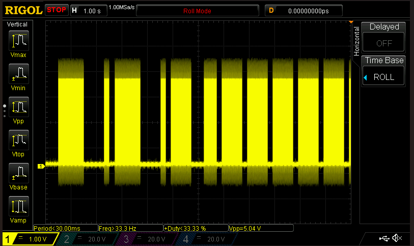
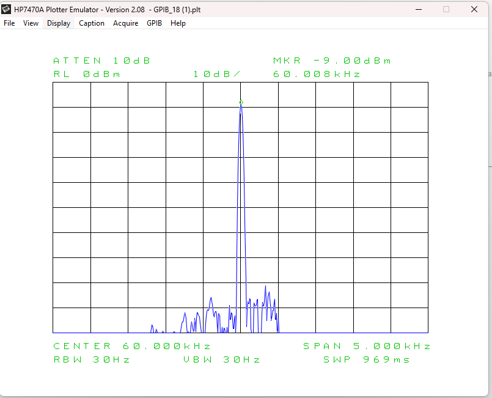

# WWVB Emulator for ESP32

This is an emulator for the WWVB time signal running on an Adafruit Huzzah32 Featherboard (ESP32).

## Overview

The goal is to create a small device that gets the current time via NTP and generates an emulated WWVB signal on a GPIO pin. This allows atomic clocks to synchronize even when the real WWVB signal from Fort Collins, Colorado is weak or unavailable.

**WWVB** is a time signal radio station near Fort Collins, Colorado, operated by NIST (National Institute of Standards and Technology). It broadcasts on 60 kHz and is used by atomic clocks throughout North America for time synchronization.

## Features

- **NTP Time Synchronization**: Automatically fetches accurate time from NTP servers
- **60 kHz WWVB Signal Generation**: Produces amplitude-modulated signal compatible with atomic clocks
- **WiFi Provisioning via BLE**: Easy wireless setup without hardcoded credentials
- **Configurable Parameters**: GPIO pins, NTP server, and retry settings via menuconfig
- **Double-Buffered Signal Generation**: Ensures glitch-free signal output
- **US Daylight Saving Time Support**: Automatically handles DST transitions

## Configuration

The following parameters can be configured via `idf.py menuconfig` under "WWVB Configuration":

- **WWVB Output GPIO Pin**: GPIO pin for 60kHz signal output (default: 26, A0 on Huzzah32)
- **Debug LED GPIO Pin**: GPIO pin for debug LED (default: 13)
- **NTP Server**: NTP server hostname or IP address (default: "pool.ntp.org")
- **WiFi Max Retry**: Maximum WiFi connection retry attempts (default: 10)

To configure these parameters:
```bash
idf.py menuconfig
```
Navigate to "WWVB Configuration" and adjust the settings as needed.

## Hardware Requirements

- **ESP32 Development Board**: Adafruit Huzzah32 Featherboard (or compatible ESP32 board)
- **Antenna** (optional): For over-the-air transmission to atomic clocks
- **Development Environment**: ESP-IDF v4.1.0 or higher

## Project Architecture

The codebase is organized into modular components:

```
main/
├── main.c              - Main application logic, ISR coordination, double-buffering
├── wwvb_encoder.c/h    - WWVB signal encoding (BCD with nibble bit extraction)
├── signal_output.c/h   - 60 kHz PWM generation, timer management
├── wifi_manager.c/h    - WiFi provisioning and connection management
├── time_sync.c/h       - SNTP time synchronization
├── dst_calc.c/h        - US Daylight Saving Time calculations
└── wwvb_config.h       - Shared configuration and debug macros
```

### Module Responsibilities

- **main.c**: Application entry point, coordinates all modules, manages double-buffered WWVB signal arrays, and handles the per-second ISR that drives signal transmission
- **wwvb_encoder**: Converts time data (year, day, hour, minute) into WWVB frame format using BCD encoding with proper bit extraction from nibbles
- **signal_output**: Generates the 60 kHz carrier using ESP32 LEDC PWM and manages signal modulation timers
- **wifi_manager**: Handles WiFi provisioning via BLE with cryptographically secure PoP generation
- **time_sync**: Manages SNTP synchronization with configurable NTP server and retry logic
- **dst_calc**: Calculates US DST boundaries (2nd Sunday in March to 1st Sunday in November)

## WWVB Signal Format

### Signal Characteristics

- **Carrier Frequency**: 60,000 Hz (60 kHz)
- **Modulation**: Amplitude modulation (AM)
- **Frame Duration**: 60 seconds (one frame per minute)
- **Power Levels**: Full power and reduced power (simulated by PWM duty cycle)

### Signal Timing - Pulse Width Encoding

WWVB encodes data using **pulse width modulation** where the duration of reduced power determines the bit value:

```
Bit Value '0':     |██|______| 0.2s low, 0.8s high (200ms reduced power)
Bit Value '1':     |████|____| 0.5s low, 0.5s high (500ms reduced power)
Position Marker:   |███████|_| 0.8s low, 0.2s high (800ms reduced power)

_ = Full carrier power (50% PWM duty cycle at 60 kHz)
█ = Reduced carrier power (0% PWM duty cycle)
```

**Why these specific timings?**
- **200ms (0.2s)**: Represents binary '0', short enough to be distinct from '1'
- **500ms (0.5s)**: Represents binary '1', exactly halfway through the second
- **800ms (0.8s)**: Position markers, longest duration for easy frame synchronization

Each second of the 60-second frame transmits one bit. The atomic clock receiver:
1. Measures the duration of reduced power each second
2. Decodes the bit value (0, 1, or marker)
3. After receiving all 60 bits, decodes the time information

### WWVB Frame Structure (60 bits, 0-59)

The WWVB signal encodes time information in a 60-second frame using Binary-Coded Decimal (BCD):

```
Position  Type        Data                Weight       Description
--------  ----------  ------------------  -----------  ------------------------------------
0         Marker      Frame Reference     -            Start of minute marker
1-8       Data        Minutes             4,2,1,40,20,10 Current minute (00-59) in BCD nibbles
9         Marker      Position Reference  -            Every 10 seconds
10-11     Reserved    Always 0            -            Reserved bits
12-18     Data        Hours               20,10,8,4,2,1 Current hour (00-23) in BCD nibbles
19        Marker      Position Reference  -            Every 10 seconds
20-21     Reserved    Always 0            -            Reserved bits
22-33     Data        Day of Year         200-1        Julian day (001-366) in BCD
34-35     Reserved    Always 0            -            Reserved bits
36-43     Data        DUT1 (obsolete)     -            Set to 0 (deprecated)
44        Reserved    Always 0            -            Reserved bit
45-53     Data        Year                80-1         2-digit year (00-99) in BCD
54        Reserved    Always 0            -            Reserved bit
55        Data        Leap Year           -            1 if leap year, 0 otherwise
56        Data        Leap Second         -            1 if leap second at end of month
57-58     Data        DST Status          -            Both bits: 11=DST, 00=Standard
59        Marker      End of Frame        -            End of minute marker

Marker positions: 0, 9, 19, 29, 39, 49, 59 (every 10 seconds, plus start/end)
```

**BCD (Binary-Coded Decimal) Encoding:**

BCD represents each decimal digit as a 4-bit binary number. WWVB uses BCD for all time fields (minutes, hours, day, year), extracting individual bits from the BCD nibbles.

For minutes and hours, bits are extracted from BCD nibbles:
- **Minutes**: Ones digit bits (4,2,1) go to positions 1-3, tens digit bits (8,4,2,1) go to positions 5-8
- **Hours**: Tens digit bits (2,1) go to positions 12-13, ones digit bits (8,4,2,1) go to positions 15-18

Example: Minute 42
- BCD: 0x0042 (tens=4=0100, ones=2=0010)
- Ones bits [2,1,0] → positions [1,2,3] → [0,1,0]
- Tens bits [3,2,1,0] → positions [5,6,7,8] → [0,1,0,0]

For year and day, BCD is used more straightforwardly with sequential bit extraction.

The BitsEncoder function converts decimal values to BCD by:
1. Extracting hundreds digit: `n / 100`
2. Extracting tens digit: `(n / 10) % 10`
3. Extracting ones digit: `n % 10`
4. Packing into a 16-bit value with each digit in a 4-bit nibble

### Example: Encoding Minute = 42

**Important:** Minutes and hours use **BCD (Binary-Coded Decimal) encoding** with bit extraction from nibbles!

```
Decimal: 42
BCD representation: 0x0042 (tens=4, ones=2)

Ones digit (2) = 0010 binary:
  Position 1: bit 2 of ones = 0 (weight 4 within ones digit)
  Position 2: bit 1 of ones = 1 (weight 2 within ones digit)
  Position 3: bit 0 of ones = 0 (weight 1 within ones digit)
  
Tens digit (4) = 0100 binary:
  Position 5: bit 3 of tens = 0 (weight 8, representing 80 minutes - unused for valid minutes)
  Position 6: bit 2 of tens = 1 (weight 4, representing 40 minutes)
  Position 7: bit 1 of tens = 0 (weight 2, representing 20 minutes)
  Position 8: bit 0 of tens = 0 (weight 1, representing 10 minutes)

Result: positions [1,2,3,5,6,7,8] = [0,1,0,0,1,0,0]

Verification: 
  Ones digit: (0*4 + 1*2 + 0*1) = 2
  Tens digit: (0*80 + 1*40 + 0*20 + 0*10) = 40
  Total: 2 + 40 = 42 ✓
```

## System Architecture

### Double-Buffer State Machine

The emulator uses **double-buffering with pointer swapping** to ensure glitch-free signal transmission:

```
┌─────────────┐           ┌─────────────┐
│   Buffer 0  │◄──Active──│     ISR     │ Reads and transmits
│  (60 bytes) │           │   (1 Hz)    │ one bit per second
└─────────────┘           └─────────────┘
       ▲                         │
       │                         │ At slot 0, swap if pending
       │ Pointer swap            ▼
       │ (atomic operation)  swap_pending=true
       │                         │
┌─────────────┐           ┌─────────────┐
│   Buffer 1  │◄─Staging──│  Main Task  │ Encodes next minute
│  (60 bytes) │           │             │ when signaled by ISR
└─────────────┘           └─────────────┘
```

**Why Double-Buffering?**
- **ISR reads from active buffer**: Never interrupted, ensures consistent frame
- **Main task writes to staging buffer**: Can take time without affecting transmission
- **Pointer swap at minute boundary**: Atomic operation (<1µs), no data copying needed
- **Prevents glitches**: No partially-updated frames are ever transmitted

### State Flow

```
1. Startup → Initialize buffers, set active/staging pointers
2. NVS Init → Prepare non-volatile storage for WiFi credentials
3. WiFi Setup → BLE provisioning or connect to saved network
4. SNTP Sync → Fetch time from NTP server, start 1-second timer
5. Main Loop:
   ┌─────────────────────────────────────────┐
   │ Main Task:                              │
   │ - Wait for update_wwvb_array flag       │
   │ - Encode current time to staging buffer │
   │ - Set swap_pending flag                 │
   └─────────────────────────────────────────┘
           ▲
           │ Signal flag
           │
   ┌─────────────────────────────────────────┐
   │ ISR (1 Hz):                             │
   │ - Advance slot (0-59)                   │
   │ - If slot==0 && swap_pending:           │
   │     Swap active↔staging pointers        │
   │ - Read active[slot]                     │
   │ - Start appropriate timer (0.2s/0.5s/0.8s) │
   │ - At slot==30 or 60: Set update flag   │
   └─────────────────────────────────────────┘
           │
           ▼
   ┌─────────────────────────────────────────┐
   │ Bit/Marker Timer ISR:                   │
   │ - Restore carrier to full power (50%)   │
   └─────────────────────────────────────────┘
```

### Timer Coordination

The system uses multiple coordinated ESP32 hardware timers:

1. **Second Timer (1 Hz)**: Main ISR that advances through the 60-second frame
   - Triggers every 1,000,000 microseconds
   - Reads current bit from active buffer
   - Starts appropriate bit timer based on value (0, 1, or marker)

2. **Bit Timers (One-shot)**:
   - **Bit0 Timer**: 200,000µs (0.2s) - After bit '0' reduced power period
   - **Bit1 Timer**: 500,000µs (0.5s) - After bit '1' reduced power period  
   - **Marker Timer**: 800,000µs (0.8s) - After marker reduced power period
   - All restore carrier to full power when they expire

**Timing Diagram for One Second:**
```
Second Timer ISR fires at t=0
    ↓
    Reduce carrier power (duty cycle → 0%)
    Start Bit Timer (200ms, 500ms, or 800ms)
    ↓
    ... carrier at reduced power ...
    ↓
    Bit Timer ISR fires
    Restore carrier power (duty cycle → 50%)
    ↓
    ... carrier at full power until next second ...
    ↓
Next Second Timer ISR fires at t=1000ms
```

### WiFi Provisioning Flow

```
┌─────────────────┐
│   Device Boot   │
└────────┬────────┘
         │
         ▼
   ┌─────────────┐
   │ Check NVS   │◄──── Non-Volatile Storage
   │ Provisioned?│
   └──────┬──────┘
          │
    ┌─────┴─────┐
    │           │
   YES         NO
    │           │
    │           ▼
    │    ┌──────────────────┐
    │    │ Generate Service │ Based on MAC address
    │    │ Name: PROV_XXXXXX│ (last 3 bytes in hex)
    │    └────────┬─────────┘
    │             │
    │             ▼
    │    ┌──────────────────┐
    │    │  Generate PoP    │ SHA-256 hash of MAC
    │    │ (12 hex chars)   │ First 6 bytes of hash
    │    └────────┬─────────┘
    │             │
    │             ▼
    │    ┌──────────────────┐
    │    │  Start BLE Adv   │ User sees PROV_XXXXXX
    │    │ Wait for Mobile  │ in ESP BLE Prov app
    │    └────────┬─────────┘
    │             │
    │             ▼
    │    ┌──────────────────┐
    │    │  User Enters:    │
    │    │  - PoP (shown in │ Logged to console
    │    │    serial output)│ for user to enter
    │    │  - WiFi SSID     │
    │    │  - WiFi Password │
    │    └────────┬─────────┘
    │             │
    │             ▼
    │    ┌──────────────────┐
    │    │ Save to NVS      │
    │    │ Deinit BLE       │
    │    └────────┬─────────┘
    │             │
    └─────────────┘
                  │
                  ▼
         ┌────────────────┐
         │  Start WiFi    │
         │  Connect to AP │
         └───────┬────────┘
                 │
                 ▼
         ┌────────────────┐
         │   Got IP via   │
         │     DHCP       │
         └───────┬────────┘
                 │
                 ▼
         ┌────────────────┐
         │  Ready for     │
         │  SNTP Sync     │
         └────────────────┘
```

**Security Note**: The PoP (Proof of Possession) is generated using SHA-256 hash of the MAC address. This prevents attackers from deriving the PoP by observing the advertised service name or scanning for MAC addresses. The PoP must be obtained from the device's serial console output.

## Building and Flashing

### Prerequisites

- ESP-IDF v4.1.0 or higher installed and configured
- USB cable to connect ESP32 board to computer
- Serial port access (driver dependent on your OS)

### Build

```bash
cd /path/to/WWVB-ESPIDF
idf.py build
```

### Flash to Device

```bash
idf.py -p /dev/ttyUSB0 flash
```
Replace `/dev/ttyUSB0` with your serial port (e.g., `COM3` on Windows, `/dev/cu.usbserial-*` on macOS).

### Monitor Serial Output

```bash
idf.py -p /dev/ttyUSB0 monitor
```

Press `Ctrl+]` to exit the monitor.

### Combined Flash and Monitor

```bash
idf.py -p /dev/ttyUSB0 flash monitor
```

## WiFi Provisioning Guide

This device uses **BLE (Bluetooth Low Energy) provisioning** for secure WiFi setup. You'll need the **ESP BLE Provisioning** app on your Android phone.

### Prerequisites

- **Android Phone** with Bluetooth enabled
- **ESP BLE Provisioning App** - Download from Google Play Store:
  - Search for "ESP BLE Provisioning" or "Espressif Bluetooth Provisioning"
  - Official app by Espressif Systems
- **Serial Console Access** - To view the device's Proof of Possession (PoP) code
  - Use `idf.py monitor` or any serial terminal at 115200 baud

### First-Time Setup (Provisioning)

Follow these steps to provision your device for the first time:

#### Step 1: Flash and Start the Device

```bash
# Flash the firmware and start monitoring
idf.py -p /dev/ttyUSB0 flash monitor
```

#### Step 2: Get the PoP Code from Serial Console

After the device boots, look for these messages in the serial output:

```
I (782) WiFi: Is provisioned: false
I (782) WiFi: Starting provisioning
I (782) WiFi: Provisioning PoP: FFAC3113281B
```

**Important:** Write down or copy the **PoP code** (e.g., `FFAC3113281B`). You'll need this in Step 5.

> **Security Note:** The PoP is generated using SHA-256 hash of your device's MAC address. This prevents unauthorized provisioning attempts. Each device has a unique PoP that cannot be guessed without access to the serial console.

#### Step 3: Open ESP BLE Provisioning App

1. Open the **ESP BLE Provisioning** app on your Android phone
2. Ensure Bluetooth is enabled on your phone
3. Grant location permissions if requested (required for BLE scanning on Android)

#### Step 4: Connect to Your Device

1. Tap **"Provision New Device"**
2. The app will scan for nearby devices
3. Look for your device in the list: **`PROV_XXXXXX`**
   - The `XXXXXX` part is derived from your device's MAC address
   - Example: `PROV_0F85BC`
4. Tap on your device name to connect

#### Step 5: Enter the Proof of Possession

1. The app will prompt for **"Proof of Possession"**
2. Enter the **PoP code** you copied from the serial console in Step 2
   - Example: `FFAC3113281B`
   - **Case-sensitive** - enter exactly as shown
3. Tap **"Next"** or **"Connect"**

If the PoP is incorrect, the connection will fail. Double-check the serial console output.

#### Step 6: Configure WiFi Credentials

1. The app will scan for available WiFi networks
2. Select your WiFi network from the list (or enter SSID manually)
3. Enter your WiFi password
4. Tap **"Provision"** or **"Apply"**

#### Step 7: Wait for Provisioning to Complete

The app will show provisioning progress:
- **"Sending credentials..."** - Transmitting your WiFi details to the device
- **"Connecting..."** - Device is connecting to your WiFi
- **"Success!"** - Provisioning completed

In the serial console, you should see:

```
I (12000) WiFi: Received Wi-Fi credentials
I (12000) WiFi:     SSID     : YourNetworkName
I (12000) WiFi:     Password : ********
I (13000) WiFi: Provisioning successful
I (14000) WiFi: WiFi started, connecting to configured AP
I (15000) WiFi: got ip:192.168.1.100
```

#### Step 8: Verify Operation

Once provisioned and connected:

1. **WiFi Connection**: Device automatically connects to your WiFi
2. **Time Sync**: Device fetches time from NTP server (`pool.ntp.org` by default)
3. **Signal Generation**: 60 kHz WWVB signal starts on GPIO 26 (A0 pin)
4. **Atomic Clock Sync**: Place your atomic clock near the ESP32
   - Most clocks sync automatically when they detect signal loss
   - Some clocks have a manual sync button

### Subsequent Boots

After initial provisioning, the device will:
1. **Automatically connect** to the saved WiFi network on every boot
2. **No need to provision again** - credentials are stored in non-volatile memory
3. **Resume operation** - Time sync and signal generation start automatically

You'll see this in the serial console:

```
I (782) WiFi: Is provisioned: true
I (782) WiFi: Already provisioned, starting Wi-Fi STA
I (1500) WiFi: WiFi started, connecting to configured AP
I (2500) WiFi: got ip:192.168.1.100
```

### Resetting WiFi Credentials (Factory Reset)

If you need to provision the device with a different WiFi network:

```bash
# Erase all stored credentials and settings
idf.py -p /dev/ttyUSB0 erase-flash

# Flash the firmware again
idf.py -p /dev/ttyUSB0 flash monitor
```

This will reset the device to factory defaults, and you can follow the provisioning steps again.

## Signal Output

The signal currently looks like this:


And is showing up as a nice spike on my spectrum analyzer (direct connection via a 20dB attenuator) - The noise is 70dB down from the peak but I don't have antennas yet so I can yet test OTA values.


## Troubleshooting

### BLE Provisioning Issues

#### Device Not Found in App
- **Ensure Bluetooth is enabled** on your Android phone
- **Grant location permissions** - Required for BLE scanning on Android
- **Check serial console** - Device should show "Starting provisioning"
- **Device may already be provisioned** - Try erasing flash: `idf.py erase-flash`
- **Move closer** - BLE range is limited (typically 10-30 feet)
- **Restart the app** - Close and reopen ESP BLE Provisioning app
- **Check device is powered** - Look for LED activity or serial output

#### PoP Code Rejected
- **Case-sensitive** - PoP must match exactly (e.g., `FFAC3113281B`)
- **Copy carefully** - Avoid typos when entering the 12-character hex code
- **Check serial console** - Verify you're using the PoP from the current boot
- **Each boot generates same PoP** - PoP is derived from MAC address, stays constant

#### Provisioning Fails After Entering Credentials
- **Wrong WiFi password** - Double-check your WiFi password
- **WiFi network not found** - Ensure your WiFi is broadcasting (not hidden)
- **2.4 GHz only** - ESP32 only supports 2.4 GHz WiFi (not 5 GHz)
- **WPA2 required** - Device doesn't support WPA3-only networks
- **Check router settings** - Some routers have MAC filtering or client limits

#### Device Connects Then Disconnects
- **Weak WiFi signal** - Move ESP32 closer to router
- **Router rejected device** - Check router logs for blocked devices
- **DHCP issues** - Ensure router has available IP addresses
- **Check retry count** - Default is 10 attempts (configurable via menuconfig)

### Time Not Synchronizing
- **Check WiFi connection** - Serial console should show "got ip:192.168.x.x"
- **Verify NTP server** - Default is `pool.ntp.org`
  - Check internet connectivity
  - Try pinging the NTP server from another device
- **Firewall/Network** - Ensure NTP traffic allowed (UDP port 123)
- **Time zone** - Device uses UTC internally, DST handled automatically
- **Wait for sync** - Initial sync can take 30-60 seconds

### Atomic Clock Not Syncing
- **Check signal output** - Use oscilloscope to verify 60 kHz signal on GPIO 26
- **Antenna connection** - Ensure GPIO 26 (A0) connected to antenna or clock input
- **Distance** - Move clock closer to ESP32 (start with 1-2 feet)
- **Manual sync** - Most atomic clocks have a manual sync button
- **Clock compatibility** - Ensure clock is designed for WWVB (60 kHz), not DCF77 (77.5 kHz)
- **Wait time** - Full sync can take 5-10 minutes for most atomic clocks
- **Orientation** - Try rotating the clock for better signal reception

### Device Keeps Rebooting
- **Power supply** - Ensure adequate power (500mA+ recommended)
- **USB cable quality** - Try a different USB cable
- **Check serial console** - Look for error messages before reboot
- **Brownout detector** - May trigger with insufficient power
- **If during provisioning** - Update to latest firmware (fixes WiFi connect issue)

### Lost WiFi Credentials / Need to Re-provision
```bash
# Erase all stored data
idf.py -p /dev/ttyUSB0 erase-flash

# Flash firmware and re-provision
idf.py -p /dev/ttyUSB0 flash monitor
```

### Serial Console Not Working
- **Check port** - Try different port: `/dev/ttyUSB0`, `/dev/ttyUSB1`, `COM3`, etc.
- **Check baud rate** - Should be 115200
- **Driver required** - Some boards need CP2102 or CH340 USB-to-serial drivers
- **Permissions (Linux)** - Add user to dialout group: `sudo usermod -a -G dialout $USER`

## Unit Tests

The project includes comprehensive unit tests for the WWVB encoder and DST calculation modules using the ESP-IDF Unity test framework.

### Running Tests

**Option 1: Using the helper script (from root directory):**
```bash
# Build, flash, and run tests
./run_tests.sh

# Or specify individual commands
./run_tests.sh build          # Build only
./run_tests.sh flash          # Flash only
./run_tests.sh monitor        # Monitor only
./run_tests.sh all            # Build, flash, and monitor (default)
./run_tests.sh clean          # Clean build artifacts

# Specify a different serial port
./run_tests.sh all /dev/ttyUSB1
```

**Option 2: Using idf.py directly (from test directory):**
```bash
# Navigate to test directory first
cd test

# Build the tests
idf.py build

# Flash and run tests on ESP32
idf.py -p /dev/ttyUSB0 flash monitor
```

**Note:** The `idf.py test` command is not used for this project. Tests are a separate ESP-IDF project in the `test/` directory.

### Common Issues

**Serial Port Busy/Locked Error:**

If you get "Could not open /dev/ttyUSB0, the port is busy":
1. **Close all serial monitors** - especially VSCode Serial Monitor
2. **Build first without flashing**: `./run_tests.sh build`
3. **Then flash separately**: `./run_tests.sh flash /dev/ttyUSB0`
4. **Or use a different port**: `./run_tests.sh all /dev/ttyACM0`

The script now provides helpful diagnostics and suggestions when port issues occur.

### Test Coverage

The test suite includes:

**WWVB Encoder Tests:**
- BCD (Binary-Coded Decimal) encoding
- Year, day, hour, and minute encoding
- Marker and indicator bit positioning
- Leap year detection
- DST indicator bits

**DST Calculation Tests:**
- Leap year calculation (Gregorian calendar rules)
- DST boundary calculations (2nd Sunday in March, 1st Sunday in November)
- DST period detection for specific dates

See [`test/README.md`](test/README.md) for detailed testing documentation and guidelines for adding new tests.

### Test Results

All tests must pass before code changes are merged. Example output:
```
Starting WWVB Unit Tests
====================================
28 Tests 0 Failures 0 Ignored 
OK
====================================
```

## Technical References

- [WWVB Time Code Format (NIST)](https://www.nist.gov/pml/time-and-frequency-division/time-distribution/radio-station-wwvb/wwvb-time-code-format)
- [WWVB Wikipedia Article](https://en.wikipedia.org/wiki/WWVB)
- [ESP-IDF Programming Guide](https://docs.espressif.com/projects/esp-idf/en/latest/)
- [ESP32 LEDC (PWM) Documentation](https://docs.espressif.com/projects/esp-idf/en/latest/esp32/api-reference/peripherals/ledc.html)

## License

This project is provided as-is for educational and personal use.
